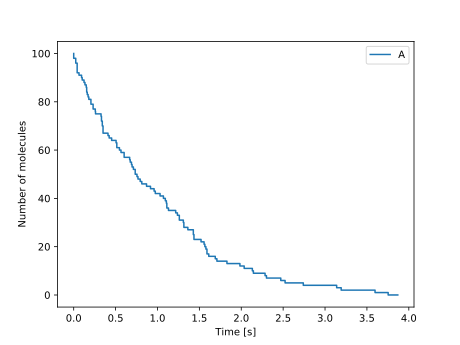

# StoSpa2

[](https://travis-ci.org/BartoszBartmanski/StoSpa2)
[](https://stospa2.readthedocs.io/en/latest/?badge=latest)

A C++ software package for stochastic simulations of spatially extended systems. Code-base has been completely refactored since the previous version of [StoSpa](https://github.com/BartoszBartmanski/StoSpa). Python bindings have also been included.

Documentation available [here](https://stospa2.readthedocs.io/en/latest/).

## Requirements

Necessary:
* C++ compiler (GCC, clang)
* Cmake (>= 3.5)
* Make (or ninja)

Optional:
* Pybind11 - to build pystospa (python binding of StoSpa2)
* Python (>=3.5)
* Boost - if boost branch of StoSpa2 is used
* Doxygen - to build C++ documentation
* Sphinx - to build python documentation

## Installation

There are two ways of using StoSpa2: with Python or with C++.

### Python

#### Easy way
```
pip install pystospaboost
```

#### Hard way
After cloning the following repository
```
git clone https://github.com/BartoszBartmanski/StoSpa2.git --recursive --branch boost
```
do the following
```
cd StoSpa2
python setup.py install
```
This way of installing pystospa assumes the following packages are installed are met
* scikit-build
* setuptools
* wheel
* cmake

### C++

The installation steps are as follows:

1. We clone the repository
```
git clone https://github.com/BartoszBartmanski/StoSpa2.git --recursive
```
Note the `recursive` flag at the end of the command, which is needed to compile python-binding of
StoSpa2.

2. We go to the StoSpa2 root directory and make a build directory
```
cd StoSpa2
mkdir build
cd build
```

3. We compile
```
cmake ../
make all
```

After the above command we can run one of the examples executable (contained in your current working directory, `<project_dir>/build`), by executing the following command
```
./examples/cme_example
```
which generates an `cme_example.dat` file.

## Example

Let us consider the following chemical reaction

$$ A \xrightarrow{k} \emptyset $$

happening at some rate $k \, [s^{-1}]$. We can simulate this chemical system with the following code, which is within the examples directory
```C++
   #include "simulator.hpp"

   int main() {
       // Create voxel object. Arguments: vector of number of molecules, size of the voxel
       std::vector<unsigned> initial_num = {100};  // number of molecules of species A
       double domain_size = 10.0;  // size of the domain in cm
       StoSpa2::Voxel v(initial_num, domain_size);

       // Create reaction object.
       // Arguments: reaction rate, propensity func, stoichiometry vector
       double k = 1.0;
       auto propensity = [](const std::vector<unsigned>& num_mols, const double& area) { return num_mols[0]; };
       std::vector<int> stoch = {-1};
       StoSpa2::Reaction r(k, propensity, {-1});

       // Add a reaction to a voxel
       v.add_reaction(r);

       // Pass the voxel with the reaction(s) to the simulator object
       StoSpa2::Simulator s({v});

       // Run the simulation. Arguments: path to output file, time step, number of steps
       s.run("cme_example.dat", 0.01, 500);
   }
```
In the first segment of the code we define the domain of the system using a single `Voxel` object, by specifiying the input arguments of the `Voxel` object, then initialising the `Voxel` object as follows:
```C++
       std::vector<unsigned> initial_num = {100};  // number of molecules of species A
       double domain_size = 10.0;  // size of the domain in cm
       StoSpa2::Voxel v(initial_num, domain_size);
```
Next, we create the reaction object by specifying the reaction rate ($k$), the propensity function and the stoichiometry vector for the decay reaction, which we then use to create a `Reaction` object in the segment below:
```C++
       double k = 1.0;
       auto propensity = [](const std::vector<unsigned>& num_mols, const double& area) { return num_mols[0]; };
       std::vector<int> stoch = {-1};
       StoSpa2::Reaction r(k, propensity, {-1});
```
After creating the `Reaction` object, we can pass it to the previously created `Voxel` object
```C++
        v.add_reaction(r);
```
Finally, we create the `Simulator` object, whose `run` function is used to run the simulation.
```C++
       StoSpa2::Simulator s({v});
       s.run("cme_example.dat", 0.01, 500);
```

We can plot the output of the simulation using the following python code
```Python
   import numpy as np
   import matplotlib.pyplot as plt

   # Open the file containing the data
   data = np.loadtxt("cme_example.dat")
   time = data[:, 0]  # Time points
   num_A = data[:, 1]  # Number of molecules of A

   # Plot the data and label the axes
   fig, ax = plt.subplots()
   ax.step(time, num_A, label="A")
   ax.set_xlabel("Time [s]")
   ax.set_ylabel("Number of molecules")
   ax.legend()
   fig.savefig("cme_example.svg")
```

The data from a simulation is saved in a space separated values format, with first value being the time, followed by number of molecules in each voxel. Hence, a single line in the data file looks like so
```
t v1.1 v1.2 ... v2.1 v2.2 ... vN.1 vN.2 ...
```
where `t` represents a particular time point and `vI.J` represents number of molecules of species `J` in voxel `I`.

For example, the output from the above code would return the following:
```
0.0 100
0.01 78
.
.
.
```
while for three voxels, with a single species of molecules the output will look like so
```
0.0 100 0 0
0.1 24 16 10
.
.
.
```


