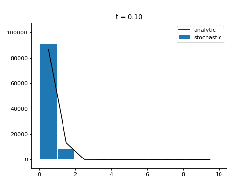

# StoSpa2

[](https://travis-ci.org/BartoszBartmanski/StoSpa2)
[](https://stospa2.readthedocs.io/en/latest/?badge=latest)

A C++ software package for stochastic simulations of spatially extended systems. Code-base has been completely refactored since the previous version of [StoSpa](https://github.com/BartoszBartmanski/StoSpa). Python bindings have also been included.

## Requirements

Necessary:
* C++ compiler (GCC, clang)
* Cmake (>= 3.5)
* Make (or ninja)

Optional:
* Pybind11 - to build pystospa (python binding of StoSpa2)
* Python (>=3.5)
* Boost - if boost branch of StoSpa2 is used
* Doxygen - to build C++ documentation
* Sphinx - to build python documentation

## Installation

There are two ways of using StoSpa2: with Python or with C++.

### Python

#### Easy way
```
pip install pystospa
```

#### Hard way
After cloning the following repository
```
git clone https://github.com/BartoszBartmanski/StoSpa2.git --recursive
```
do the following
```
cd StoSpa2
python setup.py install
```
This way of installing pystospa assumes the following packages are installed are met
* scikit-build
* setuptools
* wheel
* cmake

### C++

The installation steps are as follows:

1. We clone the repository
```
git clone https://github.com/BartoszBartmanski/StoSpa2.git --recursive
```
Note the `recursive` flag at the end of the command, which is needed to compile python-binding of
StoSpa2.

2. We go to the StoSpa2 root directory and make a build directory
```
cd StoSpa2
mkdir build
cd build
```

3. We compile
```
cmake ../
make all
```

After the above command we can run the example executable (contained in your current working directory, `<project_dir>/build`), by executing the following command
```
./example
```
which generates an `example.dat` file.

## Example

Included in the `src` directory is a cpp file `example.cpp` where we run a simple simulation of diffusion on a one-dimensional domain [0, 10] discretised into 10 voxels.

First, we include the main header from StoSpa2 and we start the main function that will contain the code for the simulation.
```
#include "simulator.hpp"

using namespace StoSpa2;

int main() {
```
Within the `main` function we first define a lambda function for the propensity function of a diffusion reaction.
```
auto diffusion = [](const std::vector<unsigned>& mols, const double& area) { return mols[0]; };
```
Then, we create an array of voxels, each of size 1, with 10000 molecules in the leftmost one, as shown below.
```
std::vector<Voxel> vs = std::vector<Voxel>(9, Voxel({0}, 1.0));
vs.insert(vs.begin(), Voxel({10000}, 1.0));
```
We add diffusion reactions to all the voxels
```
for (unsigned i=0; i<vs.size()-1; i++) {
    vs[i].add_reaction(Reaction(1.0, diffusion, {-1}, i+1));
    vs[i+1].add_reaction(Reaction(1.0, diffusion, {-1}, i));
}
```
and finally, we create a simulator instance and run the simulation.
```
Simulator sim(vs);
sim.run("example.dat", 0.01, 1000);
}
```

The resulting simulation output:


