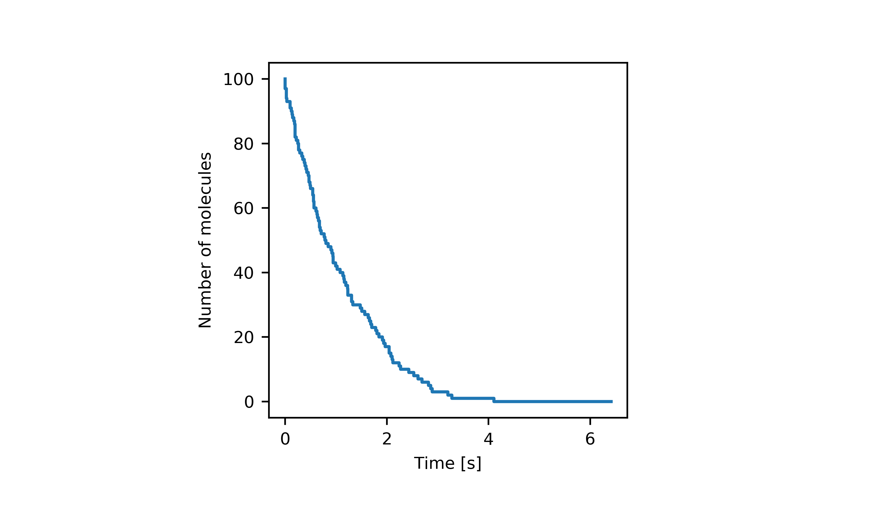
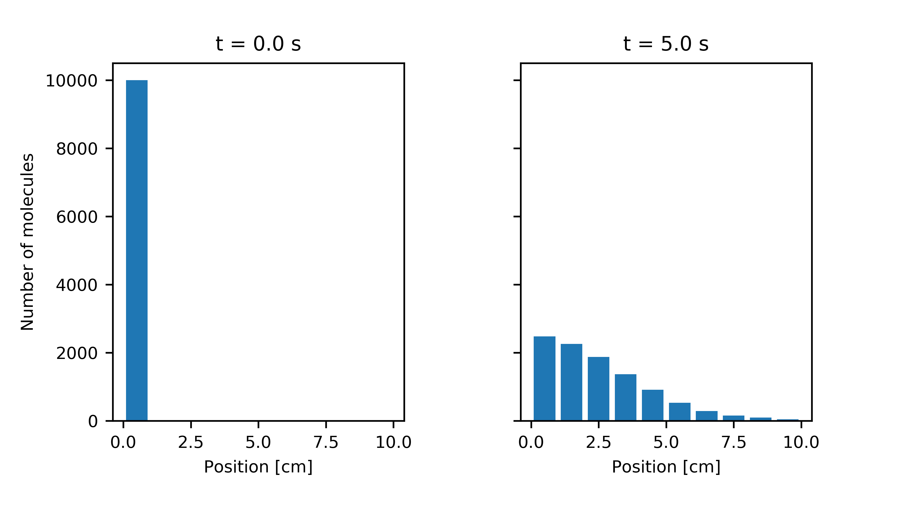
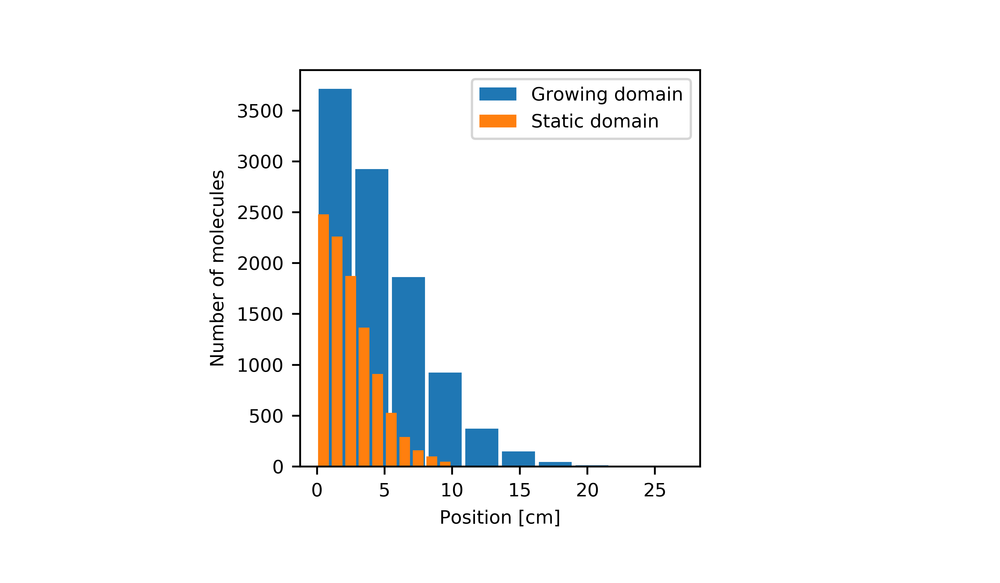

# Summary

Mathematical modelling of complex biological phenomena allows us to understand the contributions of different processes to observed behaviours. Many of these phenomena involve the reaction and diffusion of molecules and so we use so-called reaction-diffusion models to describe them mathematically. Reaction-diffusion models are often subdivided into three types [@Hellander2017]: macroscopic, mesoscopic and microscopic. Models that describe a system in terms of concentrations are termed macroscopic models. At the other end of the spectrum we have microscopic models that describe a system by specifying the positions (and often velocities) of each molecule. The middle ground between these two scales is covered by mesoscopic models, in which stochasticity and some individual-level details are included without directly tracking the position of every single molecule. Macroscale models ignore crucial details such as stochastic effects, while microscale models tend to be computationally intensive [@Osborne2017, @VanLiedekerke2015]. Mesoscale models offer a good balance in that they include stochastic effects without incurring enormous computational overheads. The frameworks of the chemical master equation (CME) and its spatial extension, the reaction-diffusion master equation (RDME) [@Isaacson2009, @Isaacson2013, @vanKampen2007], provide mesoscopic models of reaction and diffusion. However, in the majority of these cases, models built in the CME/RDME framework are analytically intractable and so model behaviours must be explored using stochastic simulation algorithms.

`StoSpa2` is a C++ software package for stochastic simulation of models constructed using the CME and RDME frameworks. This software package allows for efficient simulations with a user friendly interface, and it includes functionality for simulations on both static and growing domains, and time-varying reaction rates.

# The software

`StoSpa2` allows for a wide range of stochastic simulations within the CME and the RDME frameworks. Within the RDME framework, the simulations are independent of the mesh type, hence, the simulations can be run on both structured and unstructured meshes. Examples of both structured and unstructured meshes can be seen in \autoref{fig:meshes}. Furthermore, `StoSpa2` allows for simulations on a uniformly growing domain, by using the Extrande method [@Voliotis2016].


The core of the package is written in the C++ programming language to make simulations as efficient as possible. The number of packages need to use `StoSpa2` has been intentionally kept as small as possible to make sure that the software can be used in any computing environment that can compile C++ code.

To make the software user-friendly, the application programming interface (API) has been designed with simplicity in mind. All the details about the API can be found at `StoSpa2` documentation website (https://stospa2.readthedocs.io). Furthermore, we have included Python bindings, which allow simulations to be run from within the Python programming language. `Pybind11` (https://github.com/pybind/pybind11) is used to create `pystospa`, the Python binding of `StoSpa2`. Having a Python interface for a software package saves the user from having to recompile code themselves for every simulation, making `StoSpa2` easier to use.

The continuous integration platform TravisCI (https://travis-ci.org/) is used to make sure that any changes in the code-base do not break any functionality of `StoSpa2`. Both the installation and the functionality are tested on Linux and OSX operating systems.

# Installation

The code for `StoSpa2` is hosted on GitHub (https://github.com/BartoszBartmanski/StoSpa2) with installation instructions contained in the `README.md` file. The first way of installing `StoSpa2` involves downloading the source code from the GitHub repository and compiling the C++ code according to the instructions in the `README.md` file. However, an easier alternative is to use the Python package manager, pip, to download the Python binding of `StoSpa2`, `pystospa`, from https://pypi.org/project/pystospa/ and install it appropriately. All details of the installation, as well as more information, are contained in the documentation website (https://stospa2.readthedocs.io/en/latest/).

# Examples

In the following examples, we refer as voxels to the sub-intervals of a domain of the system to be modelled, while with a mesh we refer to how the voxels are organised in space in relation to each other.

## Chemical master equation example

As first example, let us consider the following chemical reaction
$$
    A \xrightarrow{k} \emptyset \, ,
$$
which occurs at some rate $k \, s^{-1}$ on a domain $\Omega = [0, 1]$. We can simulate this chemical system with the following code
```C++
    #include "simulator.hpp"

    int main() {

        // We define the propensity function that takes in number of molecules
        // and area of the voxel and gives back the propensity function
        auto decay = [](
            const std::vector<unsigned>& num_mols,
            const double& area)
        { return num_mols[0]; };

        // We create a reaction object
        // arguments: reaction rate, propensity function, stoichiometry vector
        StoSpa2::Reaction r(1.0, decay, {-1});

        // We create a voxel object
        // arguments: vector of number of initial number of molecules, voxel size
        StoSpa2::Voxel v({100}, 1.0);
        // and pass the previously created reaction object to it
        v.add_reaction(r);

        // We create a simulator object
        // arguments: vector of voxel objects
        StoSpa2::Simulator sim({v});
        // and use the run function
        // arguments: name of output file, time step size, number of steps
        sim.run("cme_example.dat", 0.01, 500);
    }
```
The first line of code in the above example makes sure that we can use the `StoSpa2` classes. In the main function we first define the lambda function that returns the reaction propensity
```C++
    auto decay = [](
        const std::vector<unsigned>& mols,
        const double& area)
    { return mols[0]; };
```
Though, the reaction propensity function in this case would be $k a$ with $a$ being the number of molecules of A, whereas the above lambda function returns just the number of molecules. This interface was chosen as to not repeat a lambda function definition if similar reactions appear more than once, for example if the reaction happens in multiple voxels. The lambda functions for the reaction propensities have to take two arguments: a vector and a double. The vector
represents the number of molecules and the double representing the area of a voxel. These two arguments will be passed within the Voxel class.

Next, we create both voxel and reactions objects:
```C++
    StoSpa2::Reaction r(1.0, decay, {-1});
    StoSpa2::Voxel v({100}, 1.0);
```
where we place $100$ molecules of species $A$ into a domain of size $1.0 \, cm$ (which in our case is a single
voxel of size $1.0 \, cm$). Then we assign the reaction object a rate of $k = 1.0 \, s^{-1}$, the propensity function `r` as defined before and the stoichiometry vector which decreases the number of molecules by one any time that the decay reaction happens.

We then add the reaction object we just created to the voxel object, and then run the simulation, which saves the output into `example.dat` file every `0.01` for `500` steps.
```C++
    v.add_reaction(r);

    StoSpa2::Simulator sim({v});
    sim.run("cme_example.dat", 0.01, 500);
```
We can see example output of a simulation in \autoref{fig:cme_example}.

The Python binding of `StoSpa2`, called `pystospa`, allows us to run the same simulation using the Python programming language. The Python code in this case is as follows
```Python
    import pystospa as ss

    # We define the propensity function that takes in number of molecules
    # and area of the voxel and gives back the propensity function
    decay = lambda num_mols, area : num_mols[0]

    # We create a reaction object
    # arguments: reaction rate, propensity function, stoichiometry vector
    r = ss.Reaction(1.0, decay, [-1])

    # We create a voxel object
    # arguments: vector of number of initial number of molecules, voxel size
    v = ss.Voxel([100], 1.0)
    # and pass the previously created reaction object to it
    v.add_reaction(r)

    # We create a simulator object
    # arguments: vector of voxel objects
    s = ss.Simulator([v])
    # and use the run function
    # arguments: name of output file, time step size, number of steps
    s.run("cme_example.dat", 0.01, 500)
```
which has a very similar interface as the C++ code, but has the benefit of not needing any compilation once `pystospa` is installed.



## Reaction-diffusion master equation example

To demonstrate how StoSpa2 can be used to run simulations within the RDME framework an example of a one-dimensional domain $[0 \, cm, 10 \,cm]$, discretised into $10$ voxels of equal size $1 \, cm$ is used. Within RDME framework, diffusion is modelled as a jump process, and so can be described as a series of reactions as shown below
$$
    A_1 \stackrel{d}{\rightleftharpoons} A_2 \stackrel{d}{\rightleftharpoons} A_3 \stackrel{d}{\rightleftharpoons} ... \stackrel{d}{\rightleftharpoons} A_{10} \, ,
$$
where $A_i$ is the the number of molecules of A in voxel $i$. The propensity functions for the above diffusion reactions have the following form $d a_{i}$ for a molecule of A to jump from voxel $i$ to either of the neighbouring ones. The C++ code for such a system is as follows:
```C++
    #include "simulator.hpp"

    using namespace StoSpa2;

    int main() {
        // We define the propensity function that takes in number of molecules
        // and area of the voxel and gives back the propensity function
        auto diffusion = [](
            const std::vector<unsigned>& mols,
            const double& area)
        { return mols[0]; };

        // We create an array of voxels with 10000 molecules in the leftmost one
        std::vector<Voxel> vs = std::vector<Voxel>(9, Voxel({0}, 1.0));
        vs.insert(vs.begin(), Voxel({10000}, 1.0));

        // We add diffusion reactions to all the voxels
        for (unsigned i=0; i<vs.size()-1; i++) {
            // Add a jump reaction from voxel i to voxel i+1
            vs[i].add_reaction(Reaction(1.0, diffusion, {-1}, i+1));
            // Add a jump reaction from voxel i+1 to voxel
            vs[i+1].add_reaction(Reaction(1.0, diffusion, {-1}, i));
        }

        // We create a simulator instance and run the simulation.
        Simulator sim(vs);
        sim.run("rdme_example.dat", 0.01, 500);
    }
```
which is included in the `examples` directory of StoSpa2.

The code is somewhat similar to the chemical master equation example, except we have more `Voxel` objects.
We also include the extra line `using namespace StoSpa2` to save us having to write `StoSpa2::` in
front of every `StoSpa2` class.

The first line within the main function defines the propensity function for the diffusion of molecules as
a jump process between two adjacent voxels (again with the jump rate factored out as it is given as separate parameter of the Reaction class constructor):
```C++
    auto diffusion = [](
        const std::vector<unsigned>& mols,
        const double& area)
        { return mols[0]; };
```
Then, we create a vector of `Voxel` objects, with one voxel containing $10000$ molecules:
```C++
    std::vector<Voxel> vs = std::vector<Voxel>(9, Voxel({0}, 1.0));
    vs.insert(vs.begin(), Voxel({10000}, 1.0));
```
We add reactions to the voxels, where we assume that the voxels are ordered by their position on the
$x$-axis. When adding the diffusion reactions, we have one additional parameter in the `Reaction` class constructors, namely `diffusion_idx`, which is the index of the neighbouring voxel in to which a molecule jumps if a diffusion reaction happens
```C++
    for (unsigned i=0; i<vs.size()-1; i++) {
        vs[i].add_reaction(Reaction(1.0, diffusion, {-1}, i+1));
        vs[i+1].add_reaction(Reaction(1.0, diffusion, {-1}, i));
    }
```
And finally, as in the previous example, we run the simulation with the `Simulator` class instance by
passing the vector of `Voxel` objects to it and calling the `Simulator` class run function
```C++
    Simulator sim(vs);  
    sim.run("rdme_example.dat", 0.01, 500);
```
which takes the path to a file where to save the data, followed by the size of the time-step and the number of steps to take to finish the simulation. The state of the simulation, initially and at the final time point, is shown in \autoref{fig:rdme_example} where the molecules diffuse as expected.



## Growing domain

`StoSpa2` allows for stochastic simulations on a uniformly growing domain. The example from the previous section can be extended to a simulation on a growing domain, by defining the domain of the system using $\Omega(t) = [0, L(t)]$, where $L(t) = L_0 e^{rt} \, cm$. All the voxels growth deterministically according to $h = L_0 e^{rt} / N$ where $N$ is the number of voxels, which doesn't change over the course of a simulation. As in the previous example, we discretise the domain $\Omega$ into $10$ equally-sized voxels, with $L_0 = 10 \, cm$ and $r = 0.2 \, s^{-1}$, hence the code for such a simulation is as follows

```C++
    #include "simulator.hpp"

    using namespace StoSpa2;

    int main() {
        // We define the propensity function that takes in number of molecules
        // and area of the voxel and gives back the propensity function
        auto diffusion = [](
            const std::vector<unsigned>& mols,
            const double& area)
        { return mols[0]; };

        // We define a lambda function that represents the domain growth function
        auto growth = [](const double& t) { return exp(0.2 * t); };

        // First we create an array of voxels with 10000 molecules in the leftmost one
        std::vector<Voxel> vs = std::vector<Voxel>(9, Voxel({0}, 1.0, growth));
        vs.insert(vs.begin(), Voxel({10000}, 1.0, growth));

        // We add diffusion reactions to all the voxels
        for (unsigned i=0; i<vs.size()-1; i++) {
            // Add a jump reaction from voxel i to voxel i+1
            vs[i].add_reaction(Reaction(1.0, diffusion, {-1}, i+1));
            // Add a jump reaction from voxel i+1 to voxel
            vs[i+1].add_reaction(Reaction(1.0, diffusion, {-1}, i));
        }

        // We create a simulator instance and run the simulation.
        Simulator sim(vs);
        sim.run("growing_domain.dat", 0.01, 500);
    }
```
where there are very few differences between this case and the case in the previous section. The main difference being the addition of growth function as a lambda function
```C++
    auto growth = [](const double& t) { return exp(0.2 * t); };
```
and initialising the `Voxel` objects with the growth lambda function as a third argument. The comparison of the simulation output between a static domain and a growing one can be seen in \autoref{fig:growing}, where the molecules have diffused to a space more than twice the size of the initial domain by the end of the simulation.



# Acknowledgements

B.J.B. was supported by the Engineering and Physical Sciences Research Council [grant number EP/G03706X/1]; R.E.B. is a Royal Society Wolfson Research Merit Award holder, would like to thank the Leverhulme Trust for a Research Fellowship.

# References

<!-- This will be filled in by references in paper.bib -->
